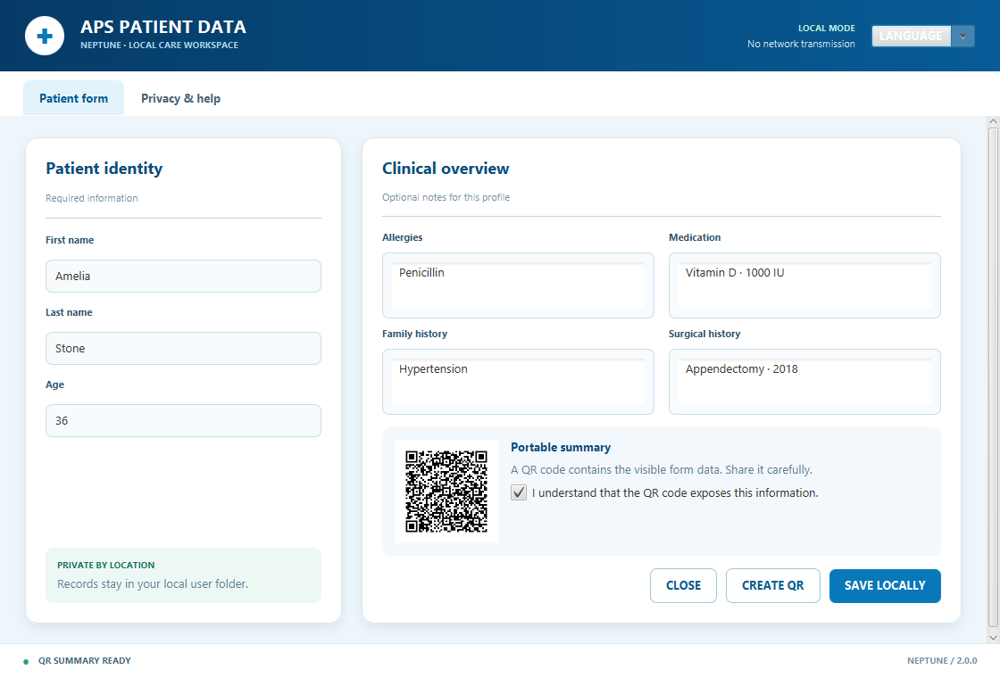

# APS Patient Data Manager · Neptune

[](https://github.com/sofoste93/aps-patient-data-manager/actions/workflows/ci.yml)
[](https://adoptium.net/)
[](https://github.com/sofoste93/aps-patient-data-manager/releases/latest)

A calm blue-and-white JavaFX workspace for recording a compact patient profile
and creating an optional QR summary. Neptune 2.0 keeps the original four
languages while making local storage and QR privacy visible to the user.



## Download

Open the [latest release](https://github.com/sofoste93/aps-patient-data-manager/releases/latest)
and choose Windows, Linux, macOS Intel or macOS Apple Silicon. Every package
includes its own Java runtime.

The repaired original interface remains available as the
[1.0.0 Maintenance Edition](https://github.com/sofoste93/aps-patient-data-manager/releases/tag/v1.0.0).

## Neptune workflow

- complete the patient identity and optional clinical notes;
- choose English, French, German or Spanish at any time;
- review validation messages in the selected language;
- save the form to the local user folder;
- explicitly approve creation of a QR image containing the visible data;
- open **Privacy & help** to see the exact storage location and safety notes.

Records are saved below the current user's home folder in
`.aps-patient-data-manager/data`. They are readable JSON files and are never
uploaded by the application.

> **Privacy boundary:** local does not mean encrypted. Neptune is an educational
> project, not a certified medical device. Do not use it for real sensitive
> health data without encryption, access controls, backups and the compliance
> review required in your jurisdiction.

## Run from source

Requirements: JDK 17 and Maven 3.9 or newer.

```bash
mvn clean verify
mvn javafx:run
```

Create the standalone Windows package:

```powershell
powershell -ExecutionPolicy Bypass -File .\scripts\package.ps1
```

Generate the current interface screenshot from the real application:

```powershell
java -jar target\aps-patient-data-2.0.0-all.jar --screenshot docs\neptune-v2.png
```

## Learning map

- `PatientFormController` connects JavaFX events to the domain services.
- `PatientFormValidator` contains UI-independent validation rules.
- `PatientDataStore` performs safe local JSON updates through a temporary file.
- `QRCodeGenerator` converts the visible summary into a JavaFX image.
- `patient-form.fxml` defines structure while `neptune.css` owns the visual theme.

Six automated tests cover validation, repeated saves, safe filenames and the
complete translation keys for all four languages.

Licensed under the [MIT License](LICENSE).
